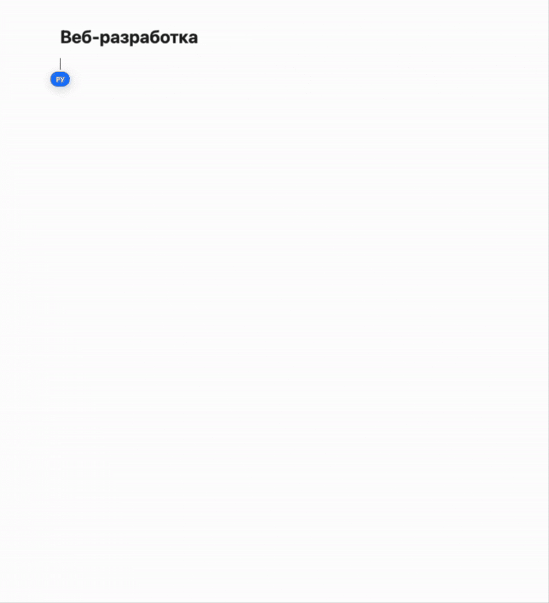

**GigaNotes** - неофициальный плагин для Obsidian, добавляющий некоторые возможности GigaChat от Сбера в ваши заметки

## Возможности
### Генерация определений
1. Выделите слово или выражение, для которого вы бы хотели сгенерировать определение
2. Вызовите палитру команд (`ctrl + p` или `cmd + p`)
3. Введите `GigaNotes: Сгенерировать определение` и нажмите `enter`
4. Готово! Определение будет сгенерировано и вставлено в ваши заметки

### Дополнение текста
1. Выделите текст, для которого вы бы хотели сгенерировать дополнение
2. Вызовите палитру команд (`ctrl + p` или `cmd + p`)
3. Введите `GigaNotes: Дополнить текст` и нажмите `enter`
4. Готово! Определение будет сгенерировано и вставлено в ваши заметки

### Контекстное меню (новое в 0.2.0!)
1. Выделите текст  
2. Щелкните правой кнопкой мыши  
3. Выберите «Сгенерировать определение» или «Дополнить текст»  

## Установка
Для установки плагина **GigaNotes** нужно установить [BRAT](https://obsidian.md/plugins?id=obsidian42-brat). После этого необходимо активировать плагин в настройках Obisidan через меню «Плагины» → «Активные плагины».  

Далее перейдите в настройки плагина и в пунтке «Beta Plugin List» добавьте GigaNotes по url https://github.com/vnkot/giga-notes

После успешного добавления необходимо вести ключ авторизации GigaChat (о том как его получить написано [здесь](https://developers.sber.ru/docs/ru/gigachat/individuals-quickstart)) в настройках плагина

## Скоро
1. Исправление автопродления авторизации (сейчас каждые 30 минут нужно перезагружать obsidian для работы плагина)
2. Учитывание контекста
3. Добавление полноценного чата
